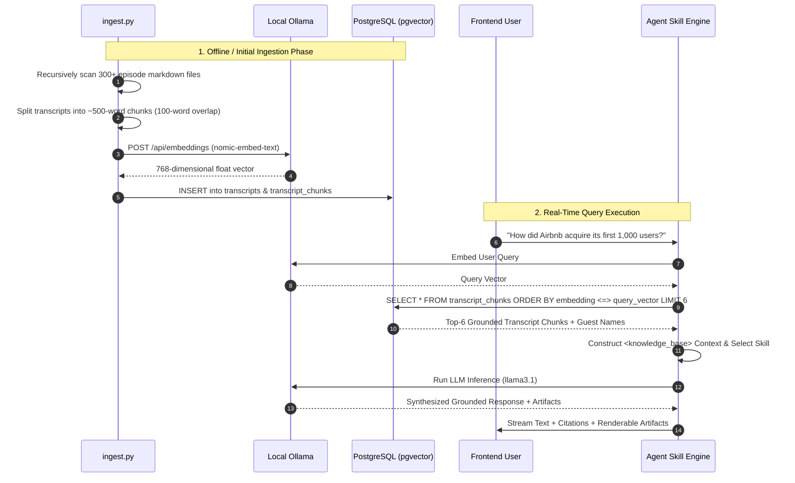

# Technical Architecture Document
## The Lenny Growth Assistant

---

## 1. System Topology & Component Boundaries

```
+-------------------------------------------------------------------------------+
|                               FRONTEND LAYER                                  |
|   React 18 + TypeScript + Vite 5 + Tailwind CSS                                |
|   - Sidebar: Session state, search, delete                                     |
|   - Chat: ReactMarkdown + remarkGfm + Citation Badges + Quick Prompts          |
|   - ArtifactViewer: Sandboxed Iframe (srcDoc + CSP) + Device Responsive Switch |
+---------------------------------------+---------------------------------------+
                                        |
                                        | HTTP / JSON (Port 8001)
                                        v
+-------------------------------------------------------------------------------+
|                                BACKEND LAYER                                  |
|   FastAPI (Python 3.11)                                                       |
|   - Routers: /sessions, /messages, /chat, /health, /ingestion/sync            |
|   - Agentic Skill Router: Standard Q&A, Ship 30 Essay, Artifact Extraction     |
|   - Multi-Turn Session History Memory                                         |
|   - LLM Abstraction: Ollama (Local) vs Anthropic (Cloud)                       |
+-------------------+-----------------------------------+-----------------------+
                    |                                   |
    Cosine Distance |                                   | Embeddings & Chat
    pgvector (<=>)  |                                   |
                    v                                   v
+---------------------------------------+   +-----------------------------------+
|            DATABASE LAYER             |   |        INFERENCE & EMBEDDING      |
|   PostgreSQL 16 + pgvector            |   |   - Local: Ollama                 |
|   - sessions, messages, artifacts     |   |     * nomic-embed-text (768-dim)  |
|   - transcripts, transcript_chunks    |   |     * llama3.1 (8B chat)          |
|   - Volume: postgres_data             |   |   - Cloud: Anthropic Claude 3.5   |
+---------------------------------------+   +-----------------------------------+
```

---

## 2. PostgreSQL Relational & Vector Schema

```sql
-- 1. Enable pgvector extension
CREATE EXTENSION IF NOT EXISTS vector;

-- 2. Sessions Table
CREATE TABLE sessions (
    id UUID PRIMARY KEY DEFAULT gen_random_uuid(),
    title VARCHAR NOT NULL DEFAULT 'New Chat',
    created_at TIMESTAMP WITH TIME ZONE DEFAULT timezone('utc', now())
);

-- 3. Messages Table
CREATE TABLE messages (
    id UUID PRIMARY KEY DEFAULT gen_random_uuid(),
    session_id UUID NOT NULL REFERENCES sessions(id) ON DELETE CASCADE,
    role VARCHAR(20) NOT NULL, -- 'user' or 'assistant'
    content TEXT NOT NULL,
    created_at TIMESTAMP WITH TIME ZONE DEFAULT timezone('utc', now())
);

-- 4. Artifacts Table
CREATE TABLE artifacts (
    id UUID PRIMARY KEY DEFAULT gen_random_uuid(),
    message_id UUID NOT NULL REFERENCES messages(id) ON DELETE CASCADE,
    type VARCHAR(50) NOT NULL, -- 'html' or 'markdown'
    title VARCHAR(255) NOT NULL,
    content TEXT NOT NULL,
    created_at TIMESTAMP WITH TIME ZONE DEFAULT timezone('utc', now())
);

-- 5. Transcripts Table
CREATE TABLE transcripts (
    id UUID PRIMARY KEY DEFAULT gen_random_uuid(),
    episode_number VARCHAR(20),
    title VARCHAR(255) NOT NULL,
    guest VARCHAR(255),
    url VARCHAR(500)
);

-- 6. Transcript Chunks Table (Vector Storage)
CREATE TABLE transcript_chunks (
    id UUID PRIMARY KEY DEFAULT gen_random_uuid(),
    transcript_id UUID NOT NULL REFERENCES transcripts(id) ON DELETE CASCADE,
    content TEXT NOT NULL,
    embedding VECTOR(768) -- Vector embedding from nomic-embed-text
);

-- Cosine Distance Index for fast retrieval
CREATE INDEX ON transcript_chunks USING ivfflat (embedding vector_cosine_ops);
```

---

## 3. RAG Ingestion & Retrieval Pipeline



---

## 4. Security Sandbox Specification for Untrusted HTML

All LLM-generated HTML/CSS/JS is treated as **untrusted code**. To eliminate Cross-Site Scripting (XSS), session hijacking, and DOM pollution, the Artifact Viewer implements a defense-in-depth isolation strategy:

1. **`<iframe>` Sandboxing (`sandbox="allow-scripts"`):**
   - **`allow-scripts`:** Permits running safe rendering logic.
   - **BLOCKED (`allow-same-origin`):** The iframe runs in a unique, null-origin security context. It CANNOT access parent window `cookies`, `localStorage`, `sessionStorage`, or IndexedDB.
   - **BLOCKED (`allow-top-navigation`):** The iframe cannot hijack or redirect the parent application tab.
   - **BLOCKED (`allow-popups`):** Cannot spawn unprompted popup windows.

2. **Content Security Policy (CSP):**
   The HTML injected via `srcDoc` includes:
   ```html
   <meta http-equiv="Content-Security-Policy" content="default-src 'self'; script-src 'none'; style-src 'unsafe-inline' https://cdn.tailwindcss.com; img-src * data:;">
   ```
   - Disallows arbitrary external script downloads (`script-src 'none'`).
   - Allows modern visual styling using Tailwind CSS CDN.

---

## 5. API Contracts

| Endpoint | Method | Description | Request Body | Response Payload |
|---|---|---|---|---|
| `/health` | `GET` | System health | None | `{"status": "ok", "service": "lenny-growth-assistant"}` |
| `/health/db` | `GET` | DB & vector stats | None | `{"status": "healthy", "corpus": {"transcripts": 300, "vector_chunks": 4200}}` |
| `/health/llm` | `GET` | Ollama & Claude status | None | `{"local_provider": {...}, "cloud_provider": {...}}` |
| `/sessions` | `POST` | Create session | `{"title": "New Chat"}` | `{"id": "uuid", "title": "New Chat"}` |
| `/sessions` | `GET` | List all sessions | None | `[{"id": "uuid", "title": "...", "message_count": 4}]` |
| `/sessions/{id}` | `DELETE`| Delete session | None | `{"status": "deleted", "id": "uuid"}` |
| `/sessions/{id}/chat` | `POST` | Conversational RAG | `{"message": "...", "provider": "ollama", "model": "llama3.1"}` | `{"message": "...", "artifacts": [...], "citations": [...]}` |
| `/ingestion/sync` | `POST` | Trigger background sync | None | `{"status": "started"}` |
